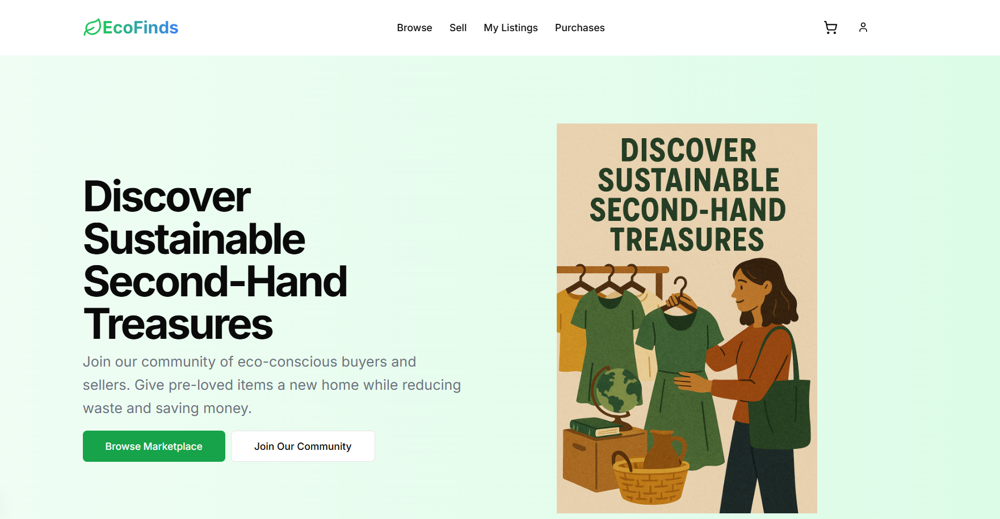

# EcoFinds - Sustainable Second-Hand Marketplace

EcoFinds is a modern web application that serves as a platform for buying and selling pre-owned goods sustainably. The project aims to promote eco-conscious consumption by giving items a second life, reducing waste, and contributing to a more sustainable future.



## 🌱 Features

- **User Authentication**: Register, login, and manage user profiles
- **Product Listings**: Browse, search, and filter products by category
- **Shopping Cart**: Add items to cart, update quantities, and checkout
- **Seller Dashboard**: Manage your product listings
- **Purchase History**: Track your purchase history
- **Responsive Design**: Fully responsive UI that works on mobile, tablet, and desktop

## 🚀 Tech Stack

- **Framework**: [Next.js 15](https://nextjs.org/)
- **Language**: [TypeScript](https://www.typescriptlang.org/)
- **Styling**: [Tailwind CSS](https://tailwindcss.com/)
- **UI Components**: [shadcn/ui](https://ui.shadcn.com/) with [Radix UI](https://www.radix-ui.com/)
- **State Management**: React Context API
- **Form Handling**: [React Hook Form](https://react-hook-form.com/) with [Zod](https://zod.dev/) validation
- **Date Handling**: [date-fns](https://date-fns.org/)
- **Icons**: [Lucide React](https://lucide.dev/)

## 📋 Prerequisites

- [Node.js](https://nodejs.org/) (v18.17.0 or higher)
- [npm](https://www.npmjs.com/) or [pnpm](https://pnpm.io/) (recommended)

## 🛠️ Installation

1. Clone the repository:
   ```bash
   git clone https://github.com/yourusername/EcoFinds-Project.git
   cd EcoFinds-Project
   ```

2. Install dependencies:
   ```bash
   npm install
   # or
   pnpm install
   ```

3. Run the development server:
   ```bash
   npm run dev
   # or
   pnpm dev
   ```

4. Open [http://localhost:3000](http://localhost:3000) in your browser to see the application.

## 🏗️ Project Structure

```
EcoFinds-Project/
├── app/                  # Next.js app directory
│   ├── auth/             # Authentication pages
│   ├── browse/           # Product browsing page
│   ├── cart/             # Shopping cart page
│   ├── my-listings/      # User's product listings
│   ├── product/          # Product detail pages
│   ├── purchases/        # Purchase history
│   ├── sell/             # Create/edit listings
│   ├── globals.css       # Global styles
│   ├── layout.tsx        # Root layout
│   └── page.tsx          # Home page
├── components/           # Reusable components
│   ├── ui/               # UI components from shadcn/ui
│   ├── navbar.tsx        # Navigation bar
│   ├── footer.tsx        # Footer component
│   └── ...               # Other components
├── context/              # React Context providers
│   ├── auth-context.tsx  # Authentication context
│   ├── cart-context.tsx  # Shopping cart context
│   ├── product-context.tsx # Product data context
│   └── purchase-context.tsx # Purchase history context
├── public/               # Static assets
├── styles/               # Additional styles
├── lib/                  # Utility functions
├── package.json          # Project dependencies
└── README.md             # Project documentation
```

## 🌟 Key Features Explained

### Authentication System

EcoFinds includes a complete authentication system with user registration, login, and profile management. For demonstration purposes, the app uses local storage to persist user data, but this can be easily replaced with a real backend authentication system.

Demo credentials:
- Email: john@example.com
- Password: password123

### Product Management

The application allows users to:
- Browse products by category
- Search for specific items
- View detailed product information
- Add products to cart
- Create and manage their own product listings

### Shopping Cart

The shopping cart functionality allows users to:
- Add products to their cart
- Update item quantities
- Remove items
- Calculate the total price
- Proceed to checkout

### Responsive Design

The UI is fully responsive and adapts to different screen sizes:
- Mobile-first approach
- Tailwind CSS for responsive styling
- Optimized layouts for mobile, tablet, and desktop

## 🧪 Data Persistence

For demonstration purposes, the application uses browser local storage to persist data:
- User accounts and authentication state
- Product listings
- Shopping cart items
- Purchase history

In a production environment, this would be replaced with a proper database and API.

## 🎨 Customization

### Themes

The application supports light and dark themes using the `next-themes` package. The theme can be toggled via the UI.

### UI Components

The UI is built using shadcn/ui, which provides a set of accessible and customizable components. You can customize the look and feel by modifying the Tailwind configuration and component styles.

## 📱 Progressive Web App (PWA)

EcoFinds can be configured as a Progressive Web App (PWA) to provide an app-like experience on mobile devices. This would require additional configuration not included in the current setup.

## 🔒 Security Considerations

- The current implementation uses local storage for data persistence, which is not secure for sensitive information in a production environment.
- In a real-world scenario, implement proper authentication with JWT or OAuth.
- Use HTTPS for all communications.
- Implement proper input validation and sanitization.

## 🚀 Deployment

The application can be deployed to various platforms:

### Vercel (Recommended)

```bash
npm install -g vercel
vercel
```

### Netlify

```bash
npm install -g netlify-cli
netlify deploy
```

## 🤝 Contributing

Contributions are welcome! Please feel free to submit a Pull Request.

1. Fork the repository
2. Create your feature branch (`git checkout -b feature/amazing-feature`)
3. Commit your changes (`git commit -m 'Add some amazing feature'`)
4. Push to the branch (`git push origin feature/amazing-feature`)
5. Open a Pull Request

## 📄 License

This project is licensed under the MIT License - see the LICENSE file for details.

## 🙏 Acknowledgements

- [Next.js](https://nextjs.org/)
- [Tailwind CSS](https://tailwindcss.com/)
- [shadcn/ui](https://ui.shadcn.com/)
- [Radix UI](https://www.radix-ui.com/)
- [Lucide Icons](https://lucide.dev/)

---

Built with ❤️ for a sustainable future.
